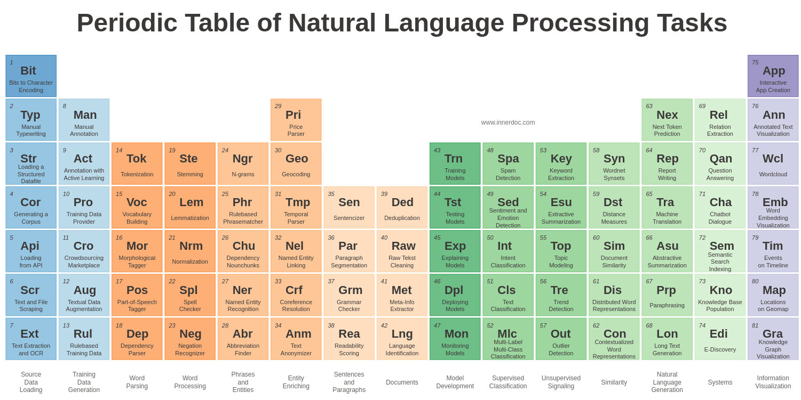
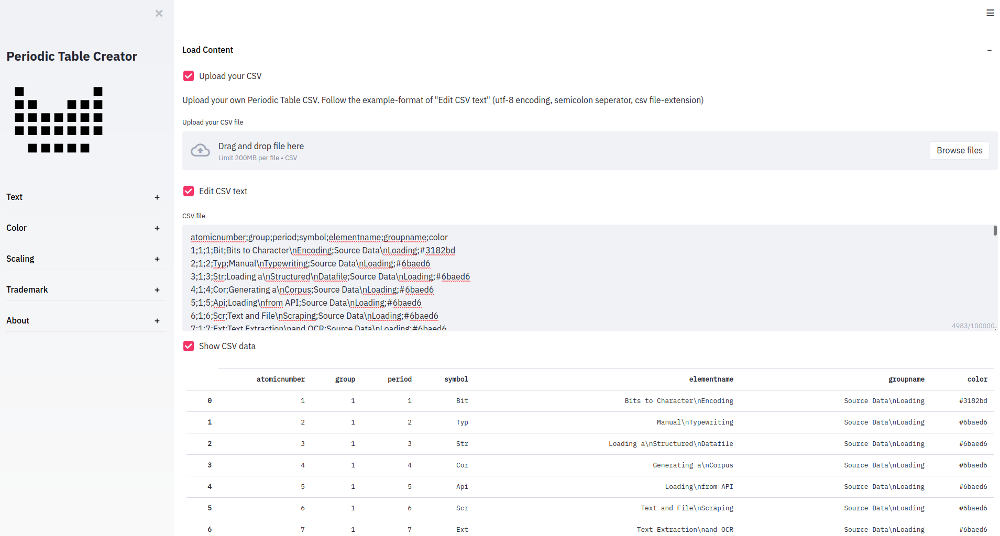
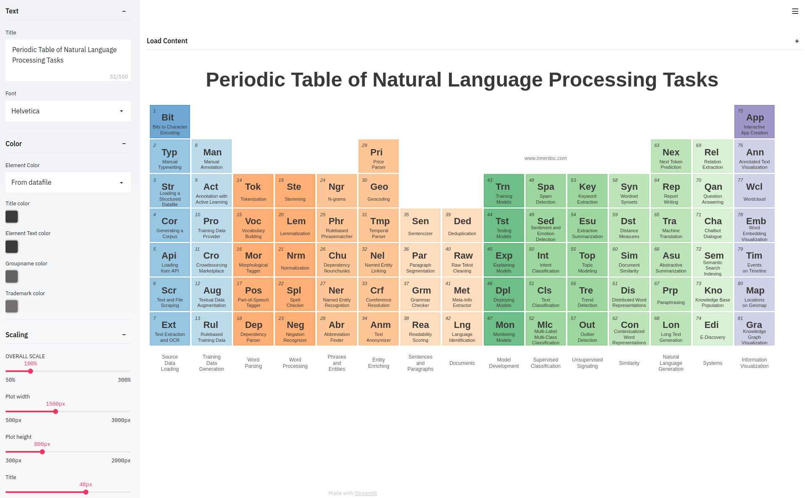

# Periodic Table Creator

[](https://www.innerdoc.com/periodic-table-demo/) [](https://twitter.com/innerdoc_nlp)


## About
This Periodic Table Generator started with the idea for a blog about a [Periodic Table of Natural Language Processing Tasks](https://www.innerdoc.com/periodic-table-of-nlp-tasks/). With the help of Streamlit and inspired by this Bokeh [gallery example](https://docs.bokeh.org/en/latest/docs/gallery/periodic.html) it became a dynamic creator that can be customized to your Periodic Table!


## The result
[Open the demo app!](https://www.innerdoc.com/periodic-table-demo/)

Below an example of a customized Periodic Table. In this case: for Natural Language Processing Tasks!




## Install and run
```
pip install -r requirements.txt
cd periodic-table-creator
streamlit run periodic_table_creator.py
```


## Load your own content
Create your own Periodic Table by loading your content via your own CSV file. Look [here](periodic-table-creator/periodic_nlp.csv) or at the "Edit CSV text" section for an example of the CSV format:
- header column names: atomicnumber;group;period;symbol;elementname;groupname;color;url;excerpt
- semicolon or comma seperated
- csv extension
- utf-8 encoding




## Customize the figure
Customize your own content in the sidebar. You can edit the Title, Font, Color, Scaling and Trademark.

